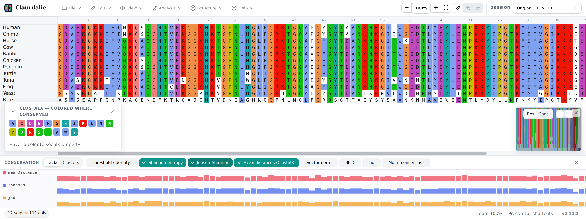

# 🧬 Claurdalie — browser-based MSA editor & analysis workbench

Explore, edit, and analyze multiple sequence alignments entirely in your browser
— smooth on thousands of sequences × tens of thousands of columns, with nothing
ever uploaded.

It's a lightweight, static-hosted reimagining of the
[Ordalie](https://lbgi.fr/ordalie) desktop tool.

**[▶️ Open the live app](https://weber8thomas.github.io/claurdalie/)**



## ✨ What it does

> **💻 Local** — runs fully in your browser, works offline, your data never
> leaves the page &nbsp;·&nbsp; **🌐 Online** — uses an optional external service
> (your sequences are sent to it)

### ✏️ Alignment

- **✏️ Edit** &nbsp;`💻` — insert/delete gaps, slide and reorder sequences, drag to select. Residues are never altered, only gaps move. Full undo/redo.
- **🎨 Color** &nbsp;`💻` — physico-chemical schemes per residue: **ClustalX**, **Zappo**, **Taylor**, and **Hydrophobicity**.
- **🔁 Re-align** a selection — in place or into a new snapshot — with **Kalign** &nbsp;`💻` (WASM, off-thread) or **MAFFT** &nbsp;`🌐` (via EMBL-EBI).

### 🔬 Analysis

- **📊 Conservation** &nbsp;`💻` — per-column scores (Shannon, Jensen-Shannon, ClustalX mean-distance, BILD, and more), shown as stacked histogram tracks or as color-coded conservation clusters. Computed off the main thread.
- **📐 Identity** &nbsp;`💻` — pairwise %-identity across all or selected sequences, with summary stats and a two-sequence picker.
- **🧩 Clustering** &nbsp;`💻` — group sequences (hierarchic, k-means, density-peaks, or Gaussian mixture); groups reorder the alignment into colored blocks.
- **🌳 Phylogenetic tree** &nbsp;`💻` — neighbor-joining with optional bootstrap; interactive dendrogram/radial viewer with re-rooting, plus Newick/NEXUS import.
- **🔎 Motif search** &nbsp;`💻` — GCG FindPatterns syntax (ambiguity codes, repeats, anchors), drawn as a grid overlay with Find Next/Prev.

### 🧊 3D structure (opt-in)

Fold a reference sequence live via **ESMFold** &nbsp;`🌐` or load a local **PDB**
&nbsp;`💻`, colored by pLDDT confidence. Hover a column to spotlight the residue
in 3D; click a residue to jump the cursor. Load and toggle several structures
independently.

### 🧪 Variants

Add point mutations (manually, by CSV/TSV, or right-click a residue), then score
their predicted impact with an offline **BLOSUM62 × conservation** scorer
&nbsp;`💻` or an online **PLM endpoint** &nbsp;`🌐`. Fold the mutant via ESMFold
&nbsp;`🌐` and overlay it on the wild-type to read RMSD and per-residue Cα
deviation.

### 💾 Sessions & persistence &nbsp;`💻`

Juggle parallel analytical hypotheses as **snapshots**; switching one restores the
exact state of the alignment and every analysis panel. Export the whole project
(or a single snapshot) to a compact **`.clproj`** file, and your working project
auto-saves to the browser and restores on reload.

### 📥 Import / export &nbsp;`💻`

FASTA in (button, drag-drop, `.fasta/.fa/.faa/.aln`) and out. Built-in demo and
heavy stress datasets. Light/dark theme, keyboard-first.

## 🚀 Getting started

```bash
npm install
npm run dev        # http://localhost:5173/claurdalie/
npm run build      # production build to dist/
npm test           # unit + property tests
```

Or use the Makefile: `make dev`, `make build`, `make check`.

See [📜 CHANGELOG.md](CHANGELOG.md) for the version history.

## ⌨️ Keyboard shortcuts

| Keys | Action |
| --- | --- |
| `F2` | Toggle cursor / edit mode |
| `Space` | Insert gap at cursor |
| `Delete` / `Backspace` | Delete gap at / before cursor |
| `⌘/Ctrl + ←/→` | Shift sequence left / right |
| `⌘/Ctrl + Z` · `⌘/Ctrl + ⇧ + Z` | Undo · Redo |
| arrows (+ `⇧`) | Move cursor / extend selection |
| `⌘/Ctrl + A` · `Esc` | Select all · clear |
| `+` / `-` / `0` | Zoom in / out / reset |
| `?` | Shortcut help |

🖱️ Mouse: **shift-drag** a residue to slide gaps · **drag a name** to reorder ·
drag to select · wheel to scroll · `⌘/Ctrl`+wheel to zoom.

## 🏗️ How it's built

The alignment surface is a single Canvas2D grid driven imperatively —
virtualized, with a pre-baked glyph atlas and a dirty-flag render loop.
**Design rule #1: React owns the chrome, never a residue.**

```
core/        typed-array alignment model, O(1) shift & reorder, undo stack, FASTA I/O
color/       pluggable color schemes (static + dynamic consensus gating)
render/      Canvas2D grid renderer behind a Renderer interface
interaction/ pointer + keyboard controller (scroll stays outside React)
ui/          React chrome only — toolbar, minimap, legend, status bar
analysis/    conservation, distance, and clustering methods (worker-safe)
tree/        neighbor-joining + bootstrap + Newick/NEXUS + layout
structure/   opt-in 3D: pluggable StructureSource (ESMFold / PDB) + WebGL viewer
variant/     mutation-effect scoring + snapshot slice + 3D highlight
align/       pluggable Aligner (Kalign-WASM, optional EBI MAFFT)
project/     snapshot spine, .clproj (de)serialization, IndexedDB persistence
workers/     numerics Web Worker with a main-thread fallback
```

## 🌍 Deployment

Static build deployed to **GitHub Pages** via `.github/workflows/deploy.yml`
(base `/claurdalie/`). No server, no COOP/COEP requirements. Version bumps on
`main` auto-tag a release via `.github/workflows/release.yml`.
